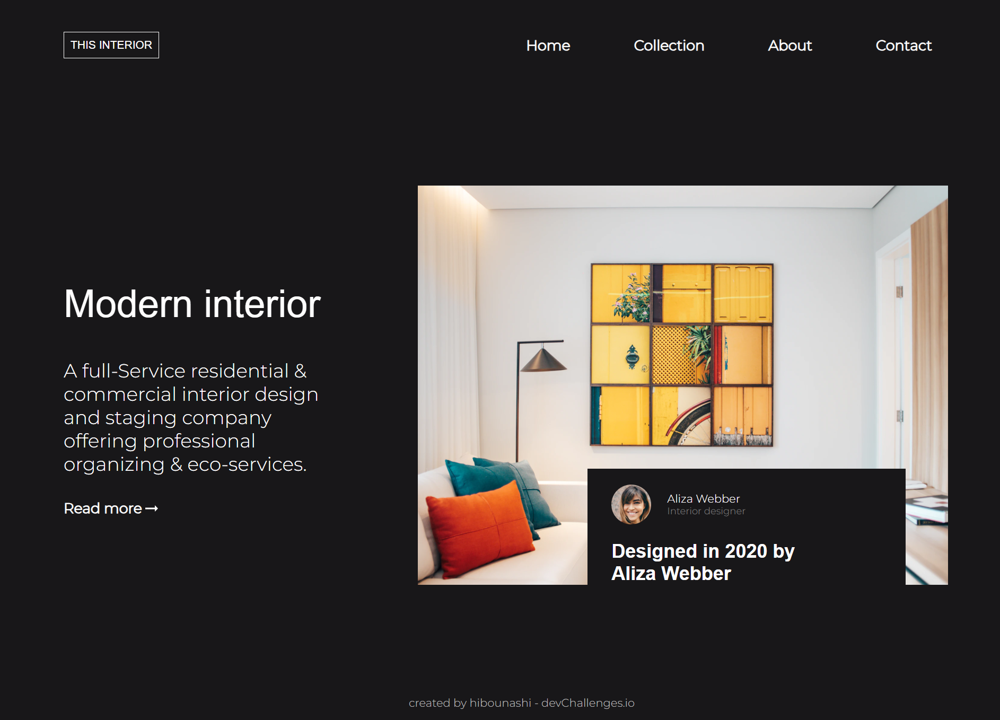
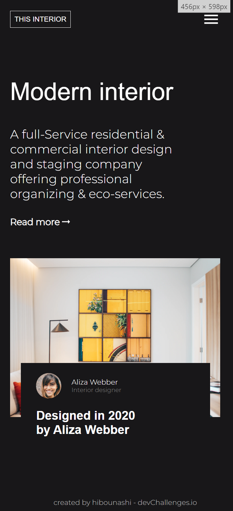

<!-- Please update value in the {}  -->

<h1 align="center">interior consultant page</h1>

   Solution for a challenge from  <a href="http://devchallenges.io" target="_blank">Devchallenges.io</a>.

  <h3>
    <a href="https://{your-demo-link.your-domain}">
      Demo
    </a>
     | 
    <a href="https://github.com/hibounashi/interior-consultant/blob/main/main.html">
      Solution
    </a>
     | 
    <a href="https://devchallenges.io/challenges/Jymh2b2FyebRTUljkNcb">
      Challenge
    </a>
  </h3>

<!-- TABLE OF CONTENTS -->

## Table of Contents

- [Overview](#overview)
- [Built With](#built-with)
- [Features](#features)
- [Contact](#contact)
- [Acknowledgements](#acknowledgements)

<!-- OVERVIEW -->

## Overview

  
   

In this challenge, I learned about new things in CSS, such as how to use animations. Additionally, I began learning and applying JavaScript on my page. In the end, I hosted my demo using W3Schools as a static website.

It took me some time to grasp new concepts in JavaScript, but it was definitely worth it in the end.
### Built With

<!-- This section should list any major frameworks that you built your project using. Here are a few examples.-->

- [html](https://reactjs.org/)
- [css](https://vuejs.org/)
- [javascript](https://tailwindcss.com/)

## Features

<!-- List the features of your application or follow the template. Don't share the figma file here :) -->

This application/site was created as a submission to a [DevChallenges](https://devchallenges.io/challenges) challenge. The [challenge](https://devchallenges.io/challenges/Jymh2b2FyebRTUljkNcb) was to build an application to complete the given user stories.

## Acknowledgements

<!-- This section should list any articles or add-ons/plugins that helps you to complete the project. This is optional but it will help you in the future. For exmpale -->

- [Steps to replicate a design with only HTML and CSS](https://devchallenges-blogs.web.app/how-to-replicate-design/)
- [W3schools](https://www.w3schools.com/js/js_examples.asp)
- [Youtube](https://youtube.com)

## Contact

- Website [COMING SOON](https://{your-web-site-link})
- GitHub [@hibounashi](https://github.com/hibounashi)
